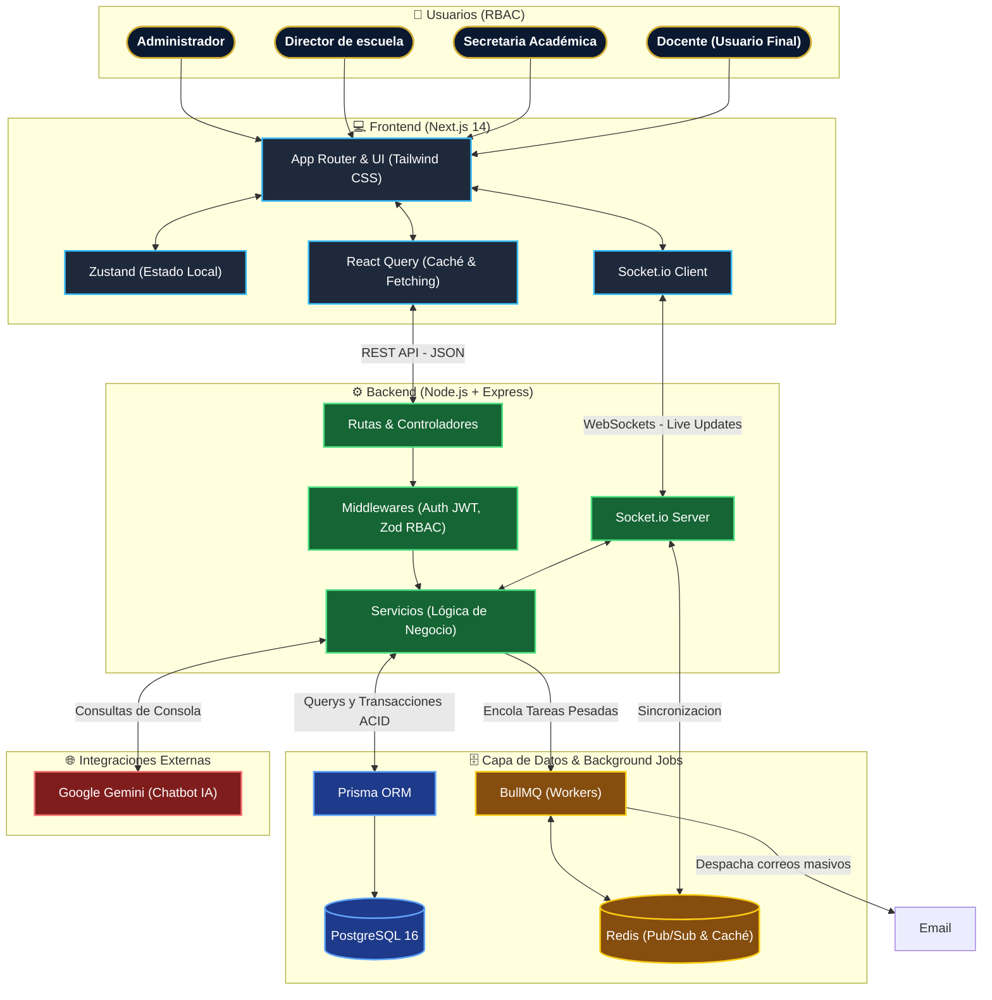

# Arquitectura del Sistema - Gestión de Horarios UNT

A continuación se detalla la arquitectura de alto nivel del sistema, ilustrando la separación de responsabilidades, el flujo de información y el stack tecnológico utilizado para garantizar un entorno seguro, reactivo y de alto rendimiento.

### Notas Arquitectónicas

1. **Desacoplamiento Total:** El Frontend (Next.js) y el Backend (Node.js) se comunican exclusivamente mediante interfaces RESTful y WebSockets. No existe renderizado del lado del servidor (SSR) acoplado a la lógica de negocio.
2. **Alta Concurrencia:** Durante la "Selección de Horarios", el `Socket.io Server` y `Redis` mantienen en memoria el bloqueo temporal de celdas para prevenir que dos docentes escojan la misma aula/hora de forma simultánea.
3. **Procesamiento Asíncrono:** La generación masiva de Anexos en PDF y envíos de notificaciones recaen en `BullMQ`, evitando el cuello de botella en los `Services` de Express.
4. **Inteligencia Artificial Segura:** El servicio de chat interactúa con `Google Gemini` asegurando enviar contexto estricto, logrando que el "Asistente UNT" responda bajo el perfil del usuario autenticado (RBAC).
